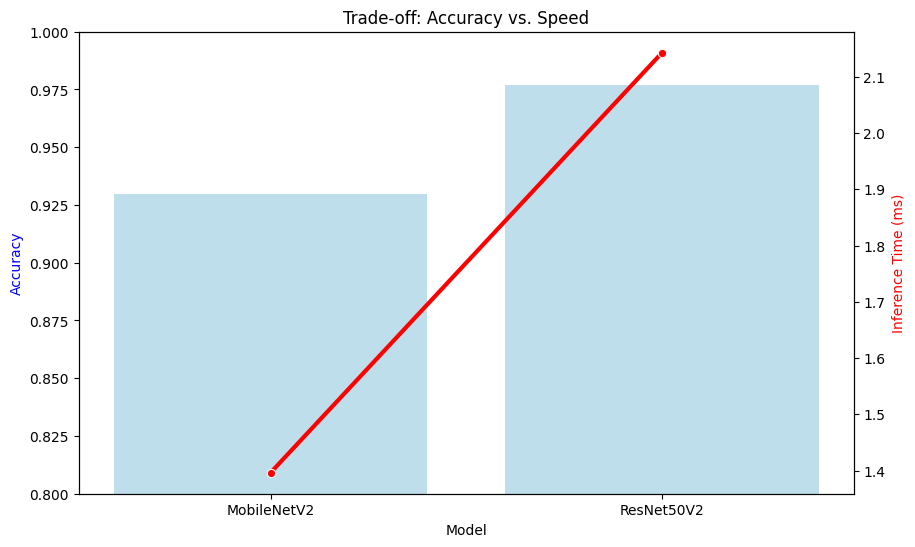

# Traffic Sign Recognition Project (GTSRB)

An end-to-end deep learning pipeline for classifying traffic signs using the **German Traffic Sign Recognition Benchmark (GTSRB)** dataset. This project implements and compares **MobileNetV2** (for efficiency) and **ResNet50V2** (for performance) using TF/Keras.


### Overview

The goal of this project is to develop a robust traffic sign classifier that balances high accuracy with low inference latency. The system is designed to be deployed as a web application using **Gradio**.


##### Key Features

- **Transfer Learning:** Utilizes pre-trained architectures (MobileNetV2, ResNet50V2).

- **Data Pipeline:** Automated downloading, extraction and preprocessing of GTSRB dataset.

- **Evaluation:** Confusion Matrices, F1-Scores, and Inference Time analysis.

- **Deployment:** Interactive web interface for real-time predictions.


##### Installation

1. **Clone the repository:**
   ```bash
       git clone [https://github.com/ZohaibHassan16/GTSRB-ML.git](https://github.com/ZohaibHassan16/GTSRB-ML.git)
       cd GTSRB-ML

2. **Install Dependencies:**
   
   It is recommended to use virtual environment.
   
       pip install -r requirements.txt

### Data Setup

This project uses the GTSRB dataset from kaggle. You can automatically download it using the included script.

    python download_data.py


### Usage

**Option 1: Run the Full Pipeline**

The `gtsrb.py` script handles data loading, training, evaluation and app launching. Just  don't forget to update paths.

    python gtsrb.py

By default, this will:

1. Train MobileNetV2 and ResNet50V2

2. Fine-tune the models.

3. Evaluate on the test set.

4. Generate comparison plots.

5. Prompt to launch the Gradio app.


**Option 2: Jupyter Notebook**

Open the notebook in Coloab and rull all the cells, recommended.


### Model Comparison

We experimented with two architectures to analyze the trade-off between model size/speed and accuracy.





While ResNet50 offers marginally higher accuracy, MobileNetV2 was selected for the final application due to its superior efficiency.


### Tech Stack

- **Core:** Python, TensorFlow, Keras

- **Data Processing:** Numpy, Pandas, OpenCV

- **Visualization:** Matplotlib, Seaborn

- **Interface:** Gradio
